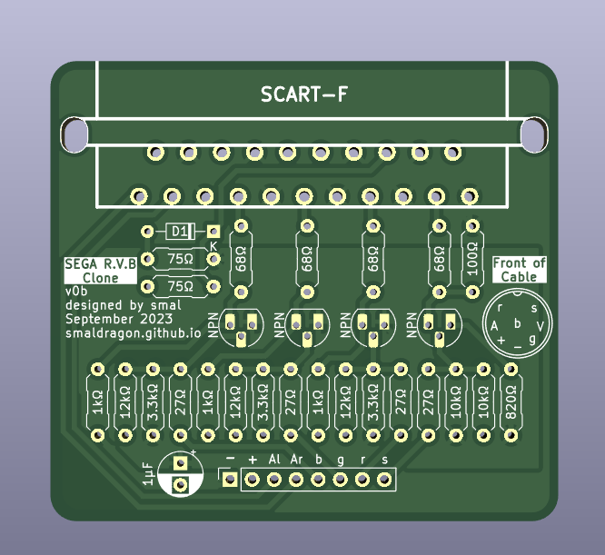

# Sega R.V.B. Clone Board

This is a clone of the "Adapteur R.V.B.", used by the french market Master System II for video output, based on the schematics avaliable at [SMSPower.org](https://www.smspower.org/Development/AdapteurRVB).

This board is intended to be a cheap diy option for consoles which have lost their original cable, and comes with all the quirks of the original circuit.

The wires of a custom DIN-8 AV cable should be soldered to the through hole pins in the bottom of the board to connect the board to an original console.

> Note: the non-critical 12V pin 8 signal which sets the tv to 4:3 mode has been ommitted from this board for simplification.

## Bill of Materials

The location and values of all Components are specified on the board itself.

| Component | Quantity |
|-----------|----------|
| Female PCB SCART Connector    | 1 |
| 1µF Decoupling Capacitor      | 1 |
| Generic Diode                 | 1 |
| Generic NPN Transistor        | 4 |
| 27Ω Resistor                  | 4 |
| 68Ω Resistor                  | 4 |
| 75Ω Resistor                  | 2 |
| 100Ω Resistor                 | 1 |
| 820Ω Resistor                 | 1 |
| 1kΩ Resistor                  | 3 |
| 3.3kΩ Resistor                | 3 |
| 10kΩ Resistor                 | 2 |
| 12kΩ Resistor                 | 3 |

## Files

The `kicad` folder contains the original files used to produce the board
The `gerber` folder contain zip files with the gerber files for board production

## Revisions

As of 2023-09-29, my latest board revision is **v0b**
